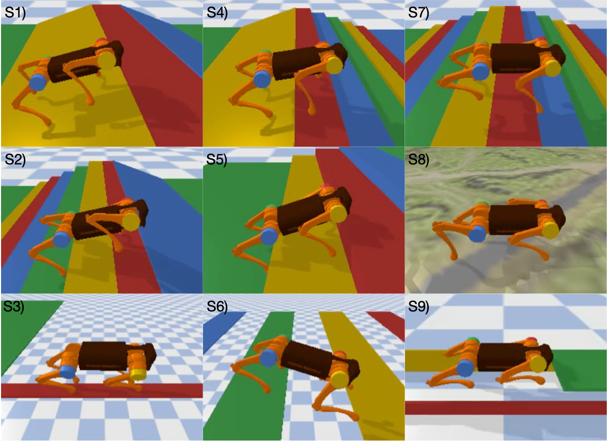
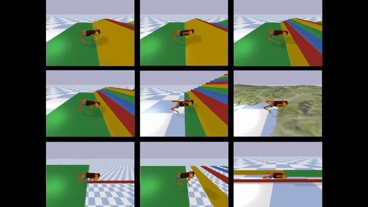
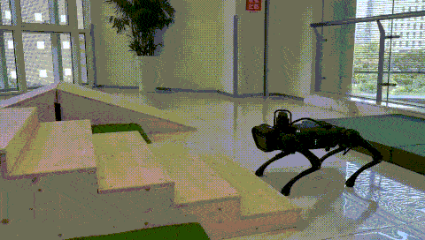

# ETG-RL

Reinforcement Learning with Evolutionary Trajectory Generator: A General Approach for Quadrupedal Locomotion



## Requirement
```txt
parl >= 1.4.0
torch >= 1.7.0
rlschool >= 1.0.2
```

## Train in Simulation


We use train.py for training. The arguments you may need to modify are as below.

| Name                    | Type    | Description                                |
| :----------------------:| :-----: | :----------------------------------------: |
| outdir                   | string   | The root directory to  save the training log and model files.                |
| suffix            | string     | The subdirectory to save the training log and model files.                |
| random_dynamic            | bool   | Randomize the dynamic or not.             |
| random_force               | bool     | Add external random force or not.          |
| task_mode               | string     | Choose a task.          |
| step_y               | float     | Specify the foot position at y axis for balance beam task.         |
| ETG               | bool     | Use ETG or not.         |
| ETG_path               | string     | The path of ETG model file.         |
| ES               | bool     | Use dual training procedure or not.         |
| es_rpm               | bool     | Store experience in replay buffer during ES phase or not.        |
| eval               | bool     | Evaluation or training.       |
| render               | bool     | Render or not.        |
| act_bound               | float     | Action bound for neural network policy.        |
| load               | string     | The path of neural network model to load.        |

For example, train ETG-RL in stairstair.
```python0
python train.py --task_mode stairstair --ETG_path data/origin_ETG/ESStair_origin.npz
```

## Evaluation

For evaluation, we also use train.py, and make the arg --eval equal to 1.
```python
python train.py --task_mode stairstair --eval 1 --load data/model/StairStair_3_itr_960231.pt
```

## BC training

After training, we get an expert policy with full state observation. Then we use behavior cloning algorithm to learn a policy with partial state observation from the expert policy. We use BCtrain.py, the arguments you may need to modify is as bellow.

| Name                    | Type    | Description                                |
| :----------------------:| :-----: | :----------------------------------------: |
| outdir                   | string   | The root directory to  save the training log and model files.                |
| suffix            | string     | The subdirectory to save the training log and model files.                |
| random_dynamic            | bool   | Randomize the dynamic or not.             |
| random_force               | bool     | Add external random force or not.          |
| task_mode               | string     | Choose a task.          |
| step_y               | float     | Specify the foot position at y axis for balance beam task.         |
| ETG               | bool     | Use ETG or not.         |
| ETG_path               | string     | The path of ETG model file.         |
| ref_path               | string     | The path of expert neural network model file.         |
| sensor_noise               | bool     | Add noise to the sensor observation or not.         |

for example, for stairstair task, we can use the following script.
```python
python BCtrain.py --task_mode stairstair --ETG_path data/model/StairStair_3_itr_960231.npz --ref_agent data/model/StairStair_3_itr_960231.pt
```

## Real Robot Deployment

To deploy our policy on the real robot, we first need to convert the ETG model to .npy file to save time for real time control. We can use env_test.py to do it.

```python
python env_test.py --load $ETG_model_path --save 1
```
Then, we should move the .npy file and neural network policy into the directory ./deployment/exp. And use ./deployment/test.py file for real robot deployment. The arguments you may need to modify are as bellow.

| Name                    | Type    | Description                                |
| :----------------------:| :-----: | :----------------------------------------: |
| ETG_path                   | string   | The path of ETG .npy file.                |
| load            | string     | The path of neural network policy model.                |
| max_time            | float     | The time of duration to deploy the policy.               |
For exmaple, deploy model in stairstair
```python
cd deployment
python test.py --ETG_path exp/stairstair/gait_action_list_ETG_stairstair7_12_3.npy --load exp/stairstair/StairStair3_BC1_itr_500383.pt --max_time 3
```